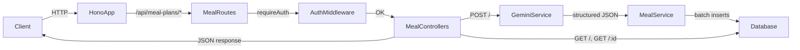

## Zaiqa AI – Backend Overview

This document describes how the backend works so a frontend (or another service) can integrate with it.

---

## 1. Tech Stack & Runtime

- **Runtime**: Bun
- **HTTP framework**: Hono
- **Database**: Neon PostgreSQL (HTTP driver)
- **ORM**: Drizzle ORM
- **Auth**: `better-auth` with Drizzle adapter
- **AI**: Google Gemini (`@google/generative-ai`, model `gemini-2.5-flash`)

Environment variables (in `.env`):

- `DATABASE_URL` – Neon Postgres connection string
- `GEMINI_API_KEY` – API key for the Gemini API

---

## 2. High-Level Request Flow



Summary:

- All meal-plan endpoints live under `/api/meal-plans`.
- All meal-plan endpoints **require authentication** (Better Auth session).
- The **POST** endpoint calls Gemini, stores the generated plan in Postgres, and returns the created plan.
- The **GET** endpoints read from Postgres only (no Gemini call).

---

## 3. Authentication Model

Auth is handled by Better Auth (`src/lib/auth.ts`) and the `requireAuth` middleware (`src/lib/auth-middleware.ts`).

- The frontend should:
  - Use Better Auth’s client SDK (or direct HTTP) to sign up/sign in.
  - Include whatever cookies/headers Better Auth requires on **all** `/api/meal-plans` requests.
- On each request:
  - `requireAuth` checks the session.
  - If no valid session: returns `401 { "error": "Unauthorized" }`.
  - If valid: attaches `user` and `session` to the Hono context.

For the frontend, the key point: **Treat all `/api/meal-plans/*` routes as “logged-in only” and make sure auth cookies are sent.**

---

## 4. Domain Model (Database Shape)

Tables are defined in `src/drizzle/schema.ts`.

### 4.1 Enums

- `cuisineEnum`: `"desi" | "western" | "arabic" | "pan_asian"`
- `spiceLevelEnum`: `"low" | "medium" | "high" | "extra_hot"`
- `planTypeEnum`: `"instant" | "one_day" | "three_day" | "week"`
- `mealSlotEnum`: `"breakfast" | "lunch" | "dinner"`
- `difficultyEnum`: `"easy" | "medium" | "hard"`

### 4.2 Meal Plan Tables

**`meal_plan`**

- `id: string` – primary key (UUID-like string, generated in app).
- `userId: string` – FK to `user.id`.
- `title: string` – user-defined title for the plan.
- `cuisine: "desi" | "western" | "arabic" | "pan_asian"`.
- `spiceLevel: "low" | "medium" | "high" | "extra_hot"`.
- `medicalConditions: string[] | null`.
- `pantryItemsSnapshot: string[] | null`.
- `planType: "instant" | "one_day" | "three_day" | "week"`.
- `createdAt: Date`.
- `updatedAt: Date`.

**`meal_plan_day`**

- `id: string`.
- `planId: string` – FK to `meal_plan.id`.
- `date: Date | null` (currently unused; usually `null`).
- `dayIndex: number` – `0`-based index inside a plan.
- `summary: string | null` – human-readable summary of that day.

**`meal_plan_entry`**

- `id: string`.
- `planDayId: string` – FK to `meal_plan_day.id`.
- `mealSlot: "breakfast" | "lunch" | "dinner"`.
- `position: number` – ordering within a slot (0,1,2,…).
- `title: string` – name of the meal.
- `description: string | null`.
- `searchKeyword: string` – phrase to search this recipe on the web.
- `imageUrl: string | null`.
- `cookingTime: string | null` – e.g. `"20 minutes"`.
- `difficulty: "easy" | "medium" | "hard"`.
- `instructions: string[] | null` – JSON array of steps.
- `ingredients: { name: string; quantity?: string; unit?: string }[] | null`.
- `servings: number | null`.
- `calories: number | null`.
- `protein: number | null`.
- `carbs: number | null`.
- `fat: number | null`.
- `weight: string | null`.

Frontend mental model:

- A **meal plan** belongs to a user and has:
  - 1..N **days**, each with:
    - 1..N **entries** (meals) for breakfast/lunch/dinner.

---

## 5. Public API Endpoints

Base URL (from `src/index.ts`):  
**`/api/meal-plans`**

All endpoints below require a valid session (auth cookies).

### 5.1 Create a meal plan (AI-generated)

- **Method**: `POST`
- **Path**: `/api/meal-plans`
- **Auth**: required
- **Body** (matches `CreateMealPlanCriteriaSchema` in `src/validators/meal.ts`):

```json
{
  "title": "string",
  "cuisine": "desi",
  "spiceLevel": "medium",
  "planType": "three_day",
  "medicalConditions": ["diabetes"],
  "pantryItemsSnapshot": ["chicken", "rice", "lentils"]
}
```

#### 5.1.1 Request rules

- `title`: required `string` – user-entered meal plan title.
- `cuisine` must be one of: `"desi" | "western" | "arabic" | "pan_asian"`.
- `spiceLevel` must be one of: `"low" | "medium" | "high" | "extra_hot"`.
- `planType` must be one of: `"instant" | "one_day" | "three_day" | "week"`.
- `medicalConditions` (optional): `string[]`.
- `pantryItemsSnapshot` (optional): `string[]`.

If the JSON is invalid or schema validation fails:

- Response: `400`

```json
{
  "error": "Invalid request body",
  "details": "Explanation message"
}
```

If the user is not authenticated:

- Response: `401 { "error": "Unauthorized" }`

If Gemini or the DB insert fails:

- Response: `500`

```json
{
  "error": "MEAL_PLAN_GENERATION_FAILED",
  "message": "Failed to generate meal plan. Please try again later."
}
```

#### 5.1.2 Success response

- Status: `201`
- Shape:

```json
{
  "plan": {
    "id": "string",
    "userId": "string",
    "title": "string",
    "cuisine": "desi",
    "spiceLevel": "medium",
    "medicalConditions": ["diabetes"],
    "pantryItemsSnapshot": ["chicken", "rice"],
    "planType": "three_day",
    "createdAt": "2026-03-11T12:34:56.000Z",
    "updatedAt": "2026-03-11T12:34:56.000Z"
  },
  "days": [
    {
      "id": "string",
      "planId": "string",
      "date": null,
      "dayIndex": 0,
      "summary": "Short day summary",
      "createdAt": "2026-03-11T12:34:56.000Z",
      "updatedAt": "2026-03-11T12:34:56.000Z",
      "entries": [
        {
          "id": "string",
          "planDayId": "string",
          "mealSlot": "breakfast",
          "position": 0,
          "title": "Oats with nuts",
          "description": "Healthy breakfast...",
          "searchKeyword": "desi oats with nuts",
          "imageUrl": null,
          "cookingTime": "15 minutes",
          "difficulty": "easy",
          "instructions": [
            "Step 1 ...",
            "Step 2 ..."
          ],
          "ingredients": [
            { "name": "oats", "quantity": "1", "unit": "cup" }
          ],
          "servings": 1,
          "calories": 350,
          "protein": 15,
          "carbs": 50,
          "fat": 8,
          "weight": "300g",
          "createdAt": "2026-03-11T12:34:56.000Z",
          "updatedAt": "2026-03-11T12:34:56.000Z"
        }
      ]
    }
  ]
}
```

This is exactly how the frontend should store and render a plan.

---

### 5.2 List meal plans (for the logged-in user)

- **Method**: `GET`
- **Path**: `/api/meal-plans`
- **Auth**: required

#### Response

- Status: `200`

```json
{
  "plans": [
    {
      "id": "string",
      "title": "string",
      "planType": "three_day",
      "cuisine": "desi",
      "spiceLevel": "medium",
      "createdAt": "2026-03-11T12:34:56.000Z"
    }
  ]
}
```

This is a **lightweight list** for showing “My Plans” / history.

If unauthenticated: `401 { "error": "Unauthorized" }`.

---

### 5.3 Get a single meal plan (with all days & entries)

- **Method**: `GET`
- **Path**: `/api/meal-plans/:id`
- **Auth**: required

`id` is the `plan.id` returned from the `POST` or `GET /api/meal-plans` listing.

#### Responses

- **200** – same shape as the `POST` success response (`{ plan, days: [...] }`).
- **404** – if the plan does not exist or does not belong to the current user:

```json
{ "error": "Meal Not Found" }
```

- **401** – if unauthenticated.

---

### 5.4 Delete a meal plan

- **Method**: `DELETE`
- **Path**: `/api/meal-plans/:id`
- **Auth**: required

Deletes a single meal plan owned by the current user. Because of foreign key `ON DELETE CASCADE` rules in the database, associated `meal_plan_day` and `meal_plan_entry` rows are automatically removed as well.

#### Responses

- **204** – plan deleted successfully (no response body).
- **404** – if the plan does not exist or does not belong to the current user:

```json
{ "error": "Meal Not Found" }
```

- **401** – if unauthenticated.

---

### 5.4 Replace a single meal entry (AI-generated alternative)

- **Method**: `PATCH`
- **Path**: `/api/meal-plans/:planId/entries/:entryId`
- **Auth**: required
- **Body**: none

Use this when the user wants to replace one meal in a plan (e.g. "I don’t like this dish, suggest something else"). The backend calls Gemini to generate one new meal that matches the plan’s cuisine, spice level, and constraints, then updates the existing entry row in place (same `id`).

- `planId`: the meal plan’s id.
- `entryId`: the `meal_plan_entry.id` to replace.

#### Responses

- **200** – updated entry:

```json
{
  "entry": {
    "id": "string",
    "planDayId": "string",
    "mealSlot": "breakfast",
    "position": 0,
    "title": "New dish name",
    "description": "...",
    "searchKeyword": "...",
    "imageUrl": null,
    "cookingTime": "15 minutes",
    "difficulty": "easy",
    "instructions": ["Step 1", "Step 2"],
    "ingredients": [{ "name": "...", "quantity": "...", "unit": "..." }],
    "servings": 1,
    "calories": 350,
    "protein": 15,
    "carbs": 50,
    "fat": 8,
    "weight": "300g",
    "createdAt": "...",
    "updatedAt": "..."
  }
}
```

- **404** – plan or entry not found (or entry not in that plan): `{ "error": "Meal Not Found" }` or `{ "error": "Entry Not Found" }`.
- **500** – `{ "error": "ENTRY_REPLACEMENT_FAILED", "message": "..." }` if Gemini or the update fails.

---

## 6. How Gemini Is Used (for Frontend Understanding)

Although the frontend never calls Gemini directly, it helps to know what happens:

1. Frontend calls `POST /api/meal-plans` with the user’s preferences.
2. Backend builds a **prompt** that includes:
   - Cuisine, spice level, plan type.
   - Medical conditions and pantry items.
   - Instructions about how many days / meals to generate for each `planType`.
3. Backend calls Gemini (`gemini-2.5-flash`) with:
   - `responseMimeType: "application/json"`.
   - A `responseSchema` that exactly matches the nested structure of `days[]` and `entries[]`.
4. Gemini returns JSON **already in the right structure**.
5. Backend converts that JSON into DB rows and saves them.
6. Backend responds to the client with the canonical shape from the DB.

The important conclusion:  
**Frontend never has to parse AI text; it always receives clean JSON that matches the DB model.**

---

## 7. Frontend Integration Checklist

- Always ensure the user is authenticated before calling `/api/meal-plans` (Better Auth session).
- For **creating** a plan:
  - Use the enums exactly as described (no typos).
  - Handle `201`, `400`, `401`, `500`.
- For **listing** plans:
  - Use `GET /api/meal-plans` to show a “My meal plans” list.
- For **viewing** a specific plan:
  - Use `GET /api/meal-plans/:id` and render `plan` + `days[].entries[]`.
- Be prepared to show meaningful UI states:
  - Loading (while Gemini and DB work).
  - Error (e.g. AI generation failed).
  - Empty state if there are no plans yet.

